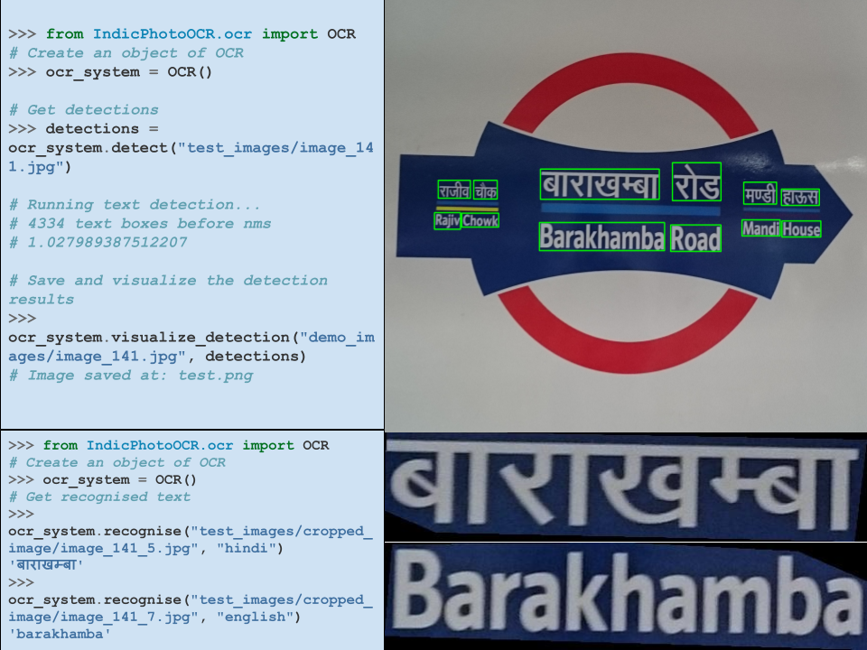

<p align="center">
  
  <h3 align="center">
A Comprehensive PhotoOCR (Scene Text Recognition) Toolkit </br> across 13 Indian Languages
  </h3>
</p>
<div align="center">

[](https://bhashini.gov.in/)
[](https://hits.seeyoufarm.com)


[](https://huggingface.co/spaces/anikde/IndicPhotoOCR)


</div>
<hr style="width: 100%; border: 1px solid #000;">


IndicPhotoOCR is an advanced PhotoOCR toolkit designed for detecting, identifying, and recognizing text across 13 Indian languages, including Assamese, Bengali, Gujarati, Hindi, Kannada, Malayalam, Marathi, Meitei Odia, Punjabi, Tamil, Telugu, Urdu, and English. Built to handle the unique scripts and complex structures of Indian languages, IndicPhotoOCR provides robust detection and recognition capabilities, making it a valuable tool for processing multilingual documents and enhancing document analysis in these diverse scripts.


<hr style="width: 100%; border: 1px solid #000;">

## Table of Content
[Updates](README.md#updates)</br>
[Installation](README.md#installation)<br>
[How to use](README.md#how-to-use)</br>
[Bharat Scene Text Dataset](README.md#related-large-scale-indian-language-scene-text-dataset)</br>
[Contributors](README.md#contributors)</br>
[Acknowledgement](README.md#acknowledgement)</br>
[Contact us](README.md#contact-us)</br>

<hr style="width: 100%; border: 1px solid #000;">


## Updates
<b>[December 2024]:</b> Detection Module: TextBPN++ added.\
<b>[November 2024]:</b> Demo available in [huggingface space](https://huggingface.co/spaces/anikde/IndicPhotoOCR).\
<b>[November 2024]:</b> Code available at [Google Colab](https://colab.research.google.com/drive/1BILXjUF2kKKrzUJ_evubgLHl2busPiH2?usp=sharing).\
<b>[November 2024]:</b> Added support for [10 languages](#config) in the recognition module.</br>
<b>[September 2024]:</b> Private repository created.
<hr style="width: 100%; border: 1px solid #000;">

## Installation
Currently we need to manually create virtual environemnt.
```python
conda create -n indicphotoocr python=3.9 -y
conda activate indicphotoocr


git clone https://github.com/Bhashini-IITJ/IndicPhotoOCR.git
cd IndicPhotoOCR
```
<details>
  <summary><b>CPU Installation</b></summary>

  ```bash
  python setup.py sdist bdist_wheel
  pip install dist/IndicPhotoOCR-1.2.0-py3-none-any.whl[cpu]
  ```
</details>

<details>
  <summary><b>CUDA 11.8 Installation</b></summary>

  ```bash
  python setup.py sdist bdist_wheel
  pip install ./dist/IndicPhotoOCR-1.2.0-py3-none-any.whl[cu118] --extra-index-url https://download.pytorch.org/whl/cu118
  ```
</details>

<details>
  <summary><b>CUDA 12.1 Installation</b></summary>

  ```bash
  python setup.py sdist bdist_wheel
  pip install ./dist/IndicPhotoOCR-1.2.0-py3-none-any.whl[cu121] --extra-index-url https://download.pytorch.org/whl/cu121
  ```
</details>
<br>

If you find any trouble with the above installation use the ```setup.sh``` script.
```bash
chmod +x setup.sh
./setup.sh
```

## Config
Currently this model works for hindi v/s english script identification and thereby hindi and english recognition.

Detection Model: TextBPN++\
ScripIndetification Model: Hindi v/s English\
Recognition Model: Hindi, English, Assamese, Bengali, Gujarati, Marathi, Odia, Punjabi, Tamil, Telugu.

## How to use
### Detection

```python
>>> from IndicPhotoOCR.ocr import OCR
# Create an object of OCR
>>> ocr_system = OCR(verbose=True) # for CPU --> OCR(device="cpu")

# Get detections
>>> detections = ocr_system.detect("test_images/image_141.jpg")

# Running text detection...
# 4334 text boxes before nms
# 1.027989387512207

# Save and visualize the detection results
>>> ocr_system.visualize_detection("test_images/image_141.jpg", detections)
# Image saved at: test.png
```

### Cropped Word Recognition
```python
>>> from IndicPhotoOCR.ocr import OCR
# Create an object of OCR
>>> ocr_system = OCR(verbose=True) # for CPU --> OCR(device="cpu")
# Get recognitions
>>> ocr_system.recognise("test_images/cropped_image/image_141_0.jpg", "hindi")
# Recognizing text in detected area...
# 'मण्डी'
```

### End-to-end Scene Text Recognition
```python
>>> from IndicPhotoOCR.ocr import OCR
# Create an object of OCR
>>> ocr_system = OCR(verbose=True) # for CPU --> OCR(device="cpu")
# Complete pipeline
>>> ocr_system.ocr("test_images/image_141.jpg")
# Identifying script for the cropped area...
# Recognizing text in detected area...
# Recognized word: रोड
# Identifying script for the cropped area...
# Recognizing text in detected area...
# Recognized word: बाराखम्बा
# Identifying script for the cropped area...
# Recognizing text in detected area...
# Recognized word: राजीव
# Identifying script for the cropped area...
# Recognizing text in detected area...
# Recognized word: चौक
# Identifying script for the cropped area...
# Recognizing text in detected area...
# Recognized word: मण्डी
# Identifying script for the cropped area...
# Recognizing text in detected area...
# Recognized word: हाऊस
# Identifying script for the cropped area...
# Recognizing text in detected area...
# Using cache found in /root/.cache/torch/hub/baudm_parseq_main
# Recognized word: rajiv
# Identifying script for the cropped area...
# Recognizing text in detected area...
# Using cache found in /root/.cache/torch/hub/baudm_parseq_main
# Recognized word: chowk
# Identifying script for the cropped area...
# Recognizing text in detected area...
# Using cache found in /root/.cache/torch/hub/baudm_parseq_main
# Recognized word: mandi
# Identifying script for the cropped area...
# Recognizing text in detected area...
# Using cache found in /root/.cache/torch/hub/baudm_parseq_main
# Recognized word: house
# Identifying script for the cropped area...
# Recognizing text in detected area...
# Using cache found in /root/.cache/torch/hub/baudm_parseq_main
# Recognized word: barakhamba
# Identifying script for the cropped area...
# Recognizing text in detected area...
# Using cache found in /root/.cache/torch/hub/baudm_parseq_main
# Recognized word: road


```
## Related Large-Scale Indian Language Scene Text Dataset 
Bharat Scene Text Dataset - [BSTD](https://github.com/Bhashini-IITJ/BharatSceneTextDataset)

## Contributors
|  |
|:---------------------------------:|
| [Anik De](https://www.linkedin.com/in/anik-de/)                         |
| Tech Lead and Main Contributor    |

|  |   | |
|:---------------------------------:|:---------------------------------:|:---------------------------------:|
| [Abhirama](https://abhiram4572.github.io/)                         | [Aditya Rathore](https://www.linkedin.com/in/aditya-rathor-87829324b/)                        | [Harshiv Shah](https://www.linkedin.com/in/harshivshah27/)| 
| Contributor              | Contributor                | Contributor                |

| | |
|:---------------------------------:|:---------------------------------:|
|[Sagar Agarwal](https://www.linkedin.com/in/sagar-agrawal-4a0b94106/)|[Rajeev Yadav](https://www.linkedin.com/in/rajeev-yadav/)|
| Contributor                | Contributor                |


|  |
|:---------------------------------:|
| [Anand Mishra](https://anandmishra22.github.io/)                         |
| Project Investigator                |
<!-- ## Training -->


## Citation

```
@misc{ipo,
  author = {Anik De et al.}
  title      = {{I}ndic{P}hoto{O}CR: A comprehensive toolkit for {I}ndian language scene text understanding},
  howpublished = {\url{https://github.com/Bhashini-IITJ/IndicPhotoOCR/}},
  year         = 2024,
}
```
## Acknowledgement

Text Recognition - [PARseq](https://github.com/baudm/parseq)\
EAST re-implemenation [repository](https://github.com/foamliu/EAST).<br/>
TextBPN++ [repository](https://github.com/GXYM/TextBPN-Plus-Plus).<br/>
National Language Translation Mission [Bhashini](https://bhashini.gov.in/).
## Contact us
For any queries, please contact us at:
- [Anik De](mailto:anekde@gmail.com)

